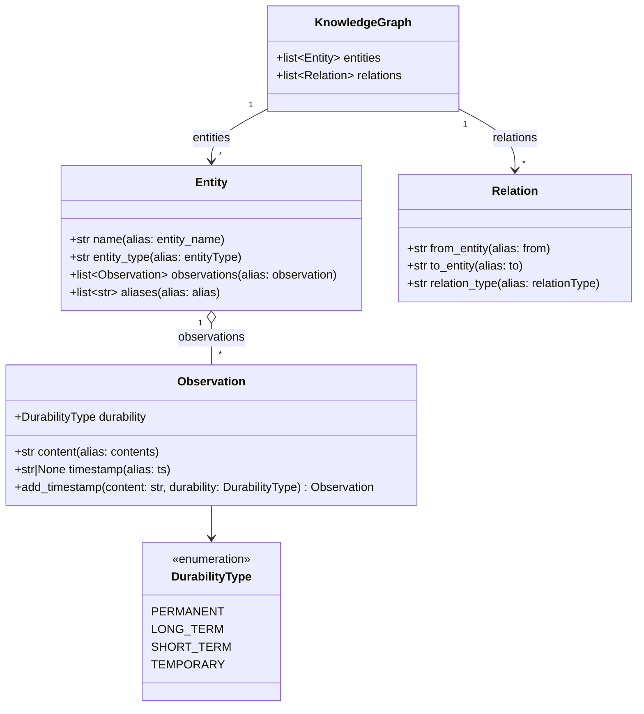
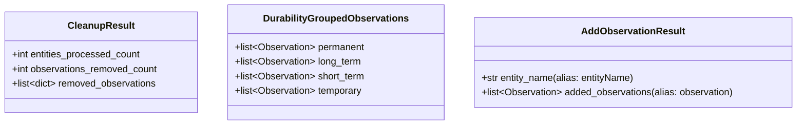
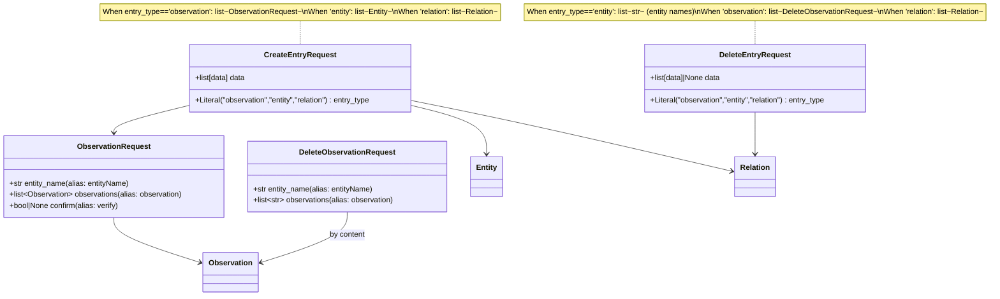

# Model cheat sheet for [[src/mcp_knowledge_graph/models.py]]

Generated overview to remember data model structures and track changes. Keep this in sync when updating the models.

## Diagrams

### Quick reference (fields and aliases)

- **DurabilityType**: `permanent`, `long-term`, `short-term`, `temporary`.
- **Observation**:
  - **content**: `str` (alias: `contents`)
  - **durability**: `DurabilityType`
  - **timestamp**: `str | None` (alias: `ts`)
  - Classmethod: `add_timestamp(content, durability)` → `Observation`
- **Entity**:
  - **name**: `str` (alias: `entity_name`)
  - **entity_type**: `str` (alias: `entityType`)
  - **observations**: `list[Observation]` (alias: `observation`)
  - **aliases**: `list[str]` (alias: `alias`)
- **Relation**:
  - **from_entity**: `str` (alias: `from`)
  - **to_entity**: `str` (alias: `to`)
  - **relation_type**: `str` (alias: `relationType`)
- **KnowledgeGraph**:
  - **entities**: `list[Entity]`
  - **relations**: `list[Relation]`
- **CleanupResult**:
  - **entities_processed_count**: `int`
  - **observations_removed_count**: `int`
  - **removed_observations**: `list[dict]`
- **DurabilityGroupedObservations**:
  - **permanent/long_term/short_term/temporary**: `list[Observation]`
- **ObservationRequest**:
  - **entity_name**: `str` (alias: `entityName`)
  - **observations**: `list[Observation]` (alias: `observation`)
  - **confirm**: `bool | None` (alias: `verify`)
- **AddObservationResult**:
  - **entity_name**: `str` (alias: `entityName`)
  - **added_observations**: `list[Observation]` (alias: `observation`)
- **DeleteObservationRequest**:
  - **entity_name**: `str` (alias: `entityName`)
  - **observations**: `list[str]` (alias: `observation`)
- **CreateEntryRequest**:
  - **entry_type**: `Literal["observation","entity","relation"]`
  - **data**: depends on `entry_type`:
    - `observation`: `list[ObservationRequest]`
    - `entity`: `list[Entity]`
    - `relation`: `list[Relation]`
- **DeleteEntryRequest**:
  - **entry_type**: `Literal["observation","entity","relation"]`
  - **data**: depends on `entry_type` (or `None` permitted):
    - `entity`: `list[str]` (entity names)
    - `observation`: `list[DeleteObservationRequest]`
    - `relation`: `list[Relation]`

### Maintenance tips

- When you add/change a field, alias or class in `src/mcp_knowledge_graph/models.py`, update both the Mermaid diagrams and the Quick reference above.
- Prefer keeping property names and aliases consistent across request/response models.
- For big refactors, add a dated note here describing the change at a high level.
