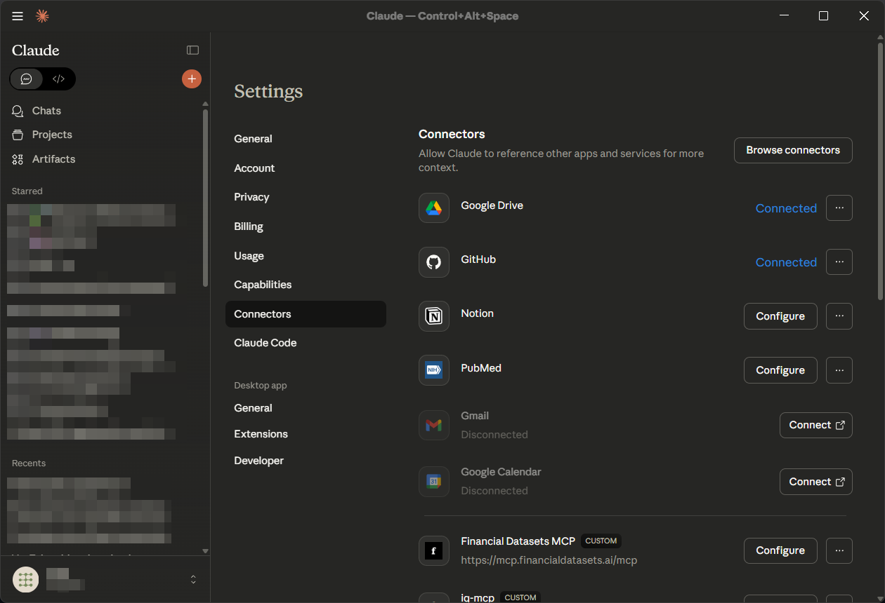
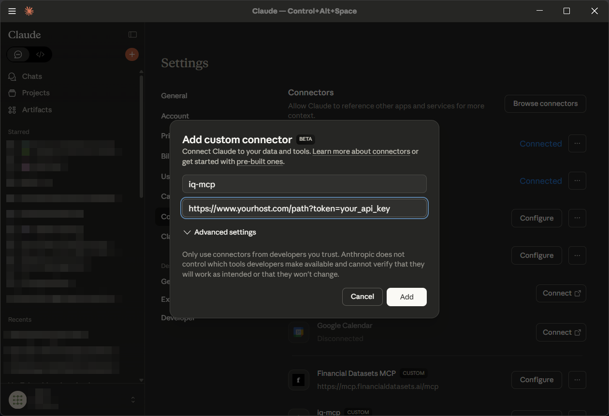

# IQ-MCP Knowledge Graph Server 🔮
*v1.3.1, released Dec 19, 2025*

A FastMCP 2.13 server that provides a temporal knowledge graph memory for LLMs. It enables persistent, searchable memory with timestamped observations, durability categories, alias-aware entity resolution, and ergonomic tools for creating, searching, maintaining, merging, and visualizing your memory graph.

This is a modern Python implementation using Pydantic models and FastMCP, designed for drop-in use with MCP clients (Claude Desktop, Cursor, Roo Code, etc.).

## ✨ Highlights

- **Temporal observations** with durability categories and automatic timestamps
- **Smart cleanup** that removes outdated observations by durability
- **Alias-aware graph**: resolve entities by name or any alias
- **Daily automatic backups** of your memory file
- **Merge entities**: consolidate duplicates while preserving relations and aliases
- **Enhanced search** across names, aliases, types, and observation content
- **Optional Supabase integration** for cloud storage and email summaries
- **Context-based architecture** with no import-time side effects

## Core Concepts

### Entities

Entities are the primary nodes in the knowledge graph. Each entity has:

- A unique 8-character alphanumeric ID
- A canonical name (identifier)
- An entity type (e.g., "person", "organization", "event")
- A list of timestamped observations (with durability)
- Optional aliases (alternative names that map to the same entity)
- Optional emoji icon

Example:

```json
{
  "id": "a1b2c3d4",
  "name": "John_Smith",
  "entity_type": "person",
  "aliases": ["Johnny Smith", "John S."],
  "icon": "👤",
  "observations": [
    {
      "content": "Speaks fluent Spanish",
      "timestamp": "2025-06-26T18:45:00.000Z",
      "durability": "permanent"
    }
  ]
}
```

### Relations

Relations define directed connections between entities. They are stored in active voice and describe how entities interact or relate to each other.

```json
{
  "from_id": "a1b2c3d4",
  "to_id": "e5f6g7h8",
  "relation": "works at"
}
```

### Temporal Observations

Observations include durability and an ISO timestamp to distinguish durable facts from transient state.

Durability categories:

- `permanent`: Never expires (e.g., "Born in 1990")
- `long-term`: Relevant for ~1+ years (e.g., "Works at Acme Corp")
- `short-term`: Relevant for ~3 months (e.g., "Working on Project X")
- `temporary`: Relevant for ~1 month (e.g., "Currently learning TypeScript")

### User Information

The knowledge graph supports a primary user with separate identity management:

- User info (name, pronouns, emails, etc.) stored separately from observations
- Linked to a user entity for observations about the user
- Computed `names` field for various name forms

## API Reference (MCP Tools)

### Entity Operations

| Tool | Description |
|------|-------------|
| `create_entities` | Add new entities with observations |
| `update_entity` | Modify entity properties (name, type, aliases, icon) |
| `merge_entities` | Combine multiple entities into one |
| `delete_entities` | Remove entities and their relations |

### Relation Operations

| Tool | Description |
|------|-------------|
| `create_relations` | Add relations between entities |
| `delete_relations` | Remove specific relations |

### Observation Operations

| Tool | Description |
|------|-------------|
| `add_observations` | Add observations to entities |

### Query Operations

| Tool | Description |
|------|-------------|
| `read_graph` | Full graph summary with user info, entities, relations |
| `read_user_info` | User information and observations |
| `search_nodes` | Search by name, type, alias, or observation content |
| `open_nodes` | Retrieve specific entities by ID or name |

### User Operations

| Tool | Description |
|------|-------------|
| `update_user_info` | Update user identifying information |

### Supabase Integration (Optional)

| Tool | Description |
|------|-------------|
| `get_new_email_summaries` | Fetch recent email summaries from Supabase |

## Usage Examples

### Create entities with observations

```json
{
  "new_entities": [
    {
      "name": "Dr_Smith",
      "entity_type": "person",
      "aliases": ["Doctor Smith"],
      "icon": "👨‍⚕️",
      "observations": [
        {"content": "Is a cardiologist", "durability": "permanent"},
        {"content": "Recently promoted to department head", "durability": "long-term"}
      ]
    }
  ]
}
```

### Create relations

```json
{
  "new_relations": [
    {
      "from_entity_name": "Dr_Smith",
      "to_entity_name": "City_Hospital",
      "relation": "works at"
    }
  ]
}
```

### Add observations

```json
{
  "new_observations": [
    {
      "entity_name": "Dr_Smith",
      "observations": [
        {"content": "Currently on vacation", "durability": "temporary"}
      ]
    }
  ]
}
```

### Search and open

```json
{"tool": "search_nodes", "params": {"query": "cardiologist"}}
```

```json
{"tool": "open_nodes", "params": {"entity_names": ["Dr_Smith", "City_Hospital"]}}
```

### Merge entities

```json
{
  "new_entity_name": "John_Smith",
  "entity_ids": ["a1b2c3d4", "e5f6g7h8"]
}
```

## Installation & Setup

This server is intended to run locally under FastMCP-compatible clients.

### 1. Clone and install

```bash
git clone https://www.github.com/study-flamingo/mcp-knowledge-graph.git
cd mcp-knowledge-graph
pip install -e .
# or using uv (recommended)
uv pip install -e .
```

### 2. Configure your MCP client

**Claude Desktop example:**

```json
{
  "mcpServers": {
    "memory": {
      "command": "python",
      "args": ["-m", "mcp_knowledge_graph", "--memory-path", "/absolute/path/to/memory.jsonl"],
      "env": {
        "IQ_TRANSPORT": "stdio",
        "IQ_DEBUG": "false"
      }
    }
  }
}
```

**Claude Desktop Setup via GUI**

1. Open `Settings > Connectors` 

2. Enter a name for your installation, and enter the url for your endpoint. Include your API key in the URL. 

3. Reload Claude Desktop. Optionally, open the Claude Desktop window menu and select `Developer > Reload MCP Configuration` to immediately connect.

**Notes:**

- Default transport is `stdio`. If setting up `IQ-MCP` on a remote host, it is preferable to use use `http` by setting `IQ_TRANSPORT`. SSE, while available, is deprecated and not recommended. However, it can also be enabled by setting this environment variable.
- Memory path may be provided via CLI `--memory-path` or environment `IQ_MEMORY_PATH`

### 3. Optional: HTTP transport

```bash
IQ_TRANSPORT=http IQ_STREAMABLE_HTTP_PORT=8000 \
python -m mcp_knowledge_graph --memory-path /absolute/path/to/memory.jsonl
```

### 4. Optional: Supabase integration

```bash
IQ_ENABLE_SUPABASE=true \
IQ_SUPABASE_URL=https://xxx.supabase.co \
IQ_SUPABASE_KEY=xxxxx \
python -m mcp_knowledge_graph
```

## Configuration

### Environment Variables

| Variable | CLI Flag | Description | Default |
|----------|----------|-------------|---------|
| `IQ_MEMORY_PATH` | `--memory-path` | Path to memory.jsonl | `./memory.jsonl` |
| `IQ_TRANSPORT` | `--transport` | Transport type: `stdio`, `http`, `sse` | `stdio` |
| `IQ_STREAMABLE_HTTP_PORT` | `--port` | Port for HTTP transport | `8000` |
| `IQ_STREAMABLE_HTTP_HOST` | `--http-host` | Host for HTTP transport | - |
| `IQ_STREAMABLE_HTTP_PATH` | `--http-path` | Path for HTTP transport | - |
| `IQ_DEBUG` | `--debug` | Enable verbose logging | `false` |
| `IQ_NO_EMOJIS` | `--no-emojis` | Disable emoji output | `false` |
| `IQ_DRY_RUN` | `--dry-run` | Skip saving changes | `false` |
| `IQ_ENABLE_SUPABASE` | `--enable-supabase` | Enable Supabase integration | `false` |
| `IQ_SUPABASE_URL` | `--supabase-url` | Supabase project URL | - |
| `IQ_SUPABASE_KEY` | `--supabase-key` | Supabase API key | - |

### Precedence

1. CLI arguments (highest)
2. Environment variables
3. Defaults (lowest)

## Data Format

### JSONL Storage

IQ-MCP stores data in a JSONL file with typed records:

```jsonl
{"type":"meta","data":{"schema_version":1,"app_version":"1.3.0","graph_id":"abc12345"}}
{"type":"user_info","data":{"preferred_name":"John","linked_entity_id":"usr12345"}}
{"type":"entity","data":{"id":"usr12345","name":"user","entity_type":"person","observations":[]}}
{"type":"relation","data":{"from_id":"usr12345","to_id":"abc12345","relation":"knows"}}
```

### Automatic Backups

Daily backups are created automatically in a `backups/` subdirectory:

```
memory.jsonl
backups/
  memory_2025-11-25.jsonl
  memory_2025-11-24.jsonl
```

### Backward Compatibility

- Loader tolerates both nested (`{"type":"entity","data":{...}}`) and flattened formats
- Lines that are malformed are skipped with warnings rather than failing the entire load

## System Prompt for Memory

Knowledge graph usage improves with a good system prompt. Example:

```markdown
# Memory Tool Usage

Follow these steps for conversational interactions:

## User Identification
Assume you are interacting with the primary user. If you have not identified them, proactively try to do so.

## Memory Retrieval
Always begin a new conversation by retrieving relevant information from your knowledge graph.
Always refer to your knowledge graph as your "memory".

## Memory Gathering
While conversing, be attentive to new information:
- Professional identity and skills
- Projects and technical work
- Learning and development goals
- Professional network
- Tools and systems used
- Personal preferences and interests

## Memory Update with Temporal Awareness
Update your memory using appropriate durability:

**Permanent**: Core identity, fundamental skills, permanent relationships
- "Is a software engineer", "Has a degree in Computer Science"

**Long-term**: Stable preferences, established systems, long-term goals
- "Uses VS Code", "Prefers Python", "Lives in Seattle"

**Short-term**: Current projects, temporary situations, 3-month goals
- "Learning Rust", "Working on Q4 roadmap"

**Temporary**: Immediate tasks, current states, monthly activities
- "Currently debugging auth issue", "Traveling next week"
```

## Production Deployment

IQ-MCP can be deployed to a cloud VM using Docker and Google Artifact Registry.

### Architecture

```
Client → https://your-domain.com/iq
         ↓
      nginx (SSL termination, /iq → /mcp rewrite)
         ↓
      iq-mcp container (FastMCP on port 8000)
         ↓
      Supabase (cloud sync) + local JSONL
```

### Deploy Scripts

| Script | Description |
|--------|-------------|
| `deploy/push-and-deploy.sh` | One-command: build, push to registry, pull on VM, restart |
| `deploy/push-image.sh` | Build and push Docker image to Artifact Registry |
| `deploy/pull-and-deploy.sh` | Runs on VM to pull latest image and restart |
| `deploy/deploy.sh` | Legacy: scp files and rebuild on VM |
| `deploy/quick-deploy.sh` | Legacy: sync source only (no rebuild) |

### Quick Deploy

```bash
# Build, push, and deploy in one command:
./deploy/push-and-deploy.sh
```

### First-Time Setup

**Local machine:**
```bash
gcloud auth login
gcloud config set project YOUR_PROJECT_ID
gcloud auth configure-docker us-central1-docker.pkg.dev
gcloud artifacts repositories create iq-mcp \
  --repository-format=docker \
  --location=us-central1
```

**On VM:**
```bash
gcloud init
gcloud auth configure-docker us-central1-docker.pkg.dev
```

Copy required files to VM:
```bash
scp docker-compose.prod.yml your-vm:/opt/iq-mcp/
scp deploy/pull-and-deploy.sh your-vm:/opt/iq-mcp/
```

### Docker Compose Files

- `docker-compose.yml` - Local development (builds from source)
- `docker-compose.prod.yml` - Production (pulls from Artifact Registry)

## Development

See **[docs/DEVELOPMENT.md](docs/DEVELOPMENT.md)** for comprehensive development guide including:
- Development setup and installation
- Running tests
- Deployment workflow (Artifact Registry)
- Project structure
- Debugging tips
- Contributing guidelines

### Quick Start

```bash
# Install dev dependencies
pip install -e ".[dev]"

# Run tests
pytest

# Visualize graph
python -m mcp_knowledge_graph.visualize --input memory.jsonl --output graph.html --title "Knowledge Graph"
```

## Architecture

```
┌─────────────────────────────────────────────────────────────┐
│  __main__.py  →  ctx.init()  →  start_server()             │
└─────────────────────────────────────────────────────────────┘
                              ↓
┌─────────────────────────────────────────────────────────────┐
│  context.py: AppContext (settings, logger, supabase)       │
└─────────────────────────────────────────────────────────────┘
                              ↓
┌─────────────────────────────────────────────────────────────┐
│  server.py: FastMCP tools + formatting                     │
└─────────────────────────────────────────────────────────────┘
                              ↓
┌─────────────────────────────────────────────────────────────┐
│  manager.py: Business logic + persistence                  │
└─────────────────────────────────────────────────────────────┘
                              ↓
┌─────────────────────────────────────────────────────────────┐
│  models.py: Pydantic data models                           │
└─────────────────────────────────────────────────────────────┘
```

See `docs/` for detailed architecture documentation.

## Changelog

See [CHANGELOG.md](CHANGELOG.md) for version history.

### Recent (v1.3.1)

- 🐛 Fixed `UpdateEntityRequest` model and `update_entity` function
- 🐛 Fixed Supabase timestamp serialization
- 🚀 Registry-based deployment workflow (Artifact Registry)
- 📚 Updated deployment documentation

### v1.3.0

- ✨ Context-based architecture with no import-time side effects
- ✨ Daily automatic backups
- ✨ Centralized version constants
- ✨ Lazy logger that works before/after initialization
- 🔄 Decoupled models from settings

## License

This MCP server is licensed under a **Non-Commercial License**. You are free to use, modify, and distribute the software for non-commercial purposes, subject to the following conditions:

- ✅ **Free use** with proper attribution
- ✅ **Modification and distribution** allowed
- ❌ **Commercial use prohibited** (in whole or in part)

See [LICENSE](LICENSE) for full terms. For commercial licensing inquiries, please contact the copyright holder.

## Credits

Enhanced by the community with temporal observation capabilities. Original implementation by Anthropic PBC as part of the Model Context Protocol servers collection.
